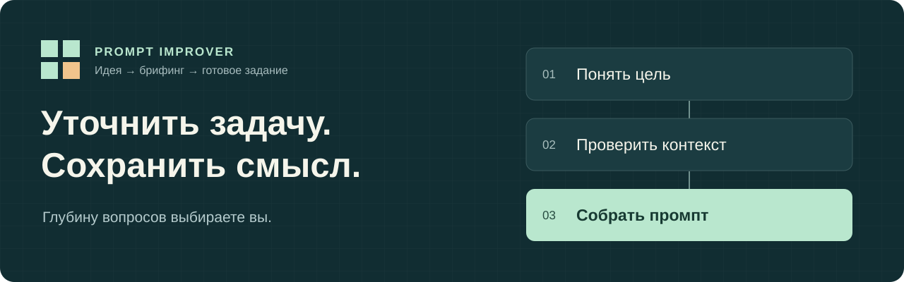

# Prompt Improver: скилл для улучшения промптов

**Помогает превратить идею в понятное задание для ИИ: уточняет цель, исследует нужный контекст и собирает готовый промпт.** Вы решаете, когда завершить вопросы.

[](project.json) [](skill/prompt-improver/SKILL.md) [](evals/AUDIT-2026-09-06.md)

**Русский** · [English](README.en.md)



[Установить](#install) · [Посмотреть пример](#example) · [Управлять вопросами](#briefing) · [Изучить проверки](#evaluations)

Prompt Improver — prompt engineering skill для сбора требований и улучшения запросов к языковым моделям. Его можно установить в Codex или передать единую спецификацию в ChatGPT, Claude, Gemini и другую среду, которая принимает текстовые инструкции. Сервер и отдельный сервис не нужны; модель и её инструменты предоставляет ваша среда.

<a id="install"></a>

## Установка скилла в Codex

Если установлен Node.js с `npx`, выполните:

```bash
npx skills add saymonseo/prompt-improver --skill prompt-improver --agent codex --global
```

Команда использует открытый [установщик Skills CLI](https://github.com/vercel-labs/skills). Он обнаруживает скилл в этом репозитории; проверено с версией 1.5.23. При обновлении существующей установки сначала проверьте свои локальные изменения.

После загрузки скилла средой начните диалог:

```text
$prompt-improver мне нужно создать интернет-магазин
```

**Без Node.js:** скопируйте целиком папку [skill/prompt-improver](https://github.com/saymonseo/prompt-improver/tree/main/skill/prompt-improver), включая `references` и `agents`, в каталог навыков Codex: `$CODEX_HOME/skills` или `~/.codex/skills`, если `CODEX_HOME` не задан. Сохраните имя папки `prompt-improver`.

### Как использовать в ChatGPT, Claude или другой модели

Приложите [SPECIFICATION.md](SPECIFICATION.md) к новому диалогу либо вставьте её содержимое. Затем отдельным сообщением передайте задачу:

```text
Используй спецификацию как инструкцию помощника по постановке задач для ИИ.
Помоги уточнить мой замысел и подготовь готовый промпт.
Моя задача: [опишите её своими словами].
```

В спецификации собраны все инструкции; дополнительные файлы скилла прикладывать не нужно. Возможность чтения вложений и соблюдение инструкций зависят от выбранной среды. Это способ передать текст, а не подтверждение одинакового качества на всех перечисленных моделях.

<a id="example"></a>

## Пример: от идеи интернет-магазина к заданию

**Исходный запрос:** «Мне нужно создать интернет-магазин».

В брифинге пользователь уточнил: детская одежда до 10 лет, русский язык, 1000 товаров и 10 категорий, самовывоз в Краснодаре, доставка собственной машиной по краю, без онлайн-оплаты. Товары ведёт менеджер; материалов пока нет.

**Фрагмент итогового промпта после этих ответов:**

```text
Подготовь дизайн, прототип и работающий интернет-магазин детской одежды
для детей до 10 лет. Язык — русский. Каталог: 1000 товаров, 10 категорий.
Предусмотри оформление заказа без онлайн-оплаты, самовывоз в Краснодаре
и доставку собственной машиной по Краснодарскому краю.
Товарами управляет менеджер по продажам.

Материалы, стек, хостинг, правила и стоимость доставки пока не определены.
Не представляй их как согласованные. Не придумывай реальные товары,
фотографии, цены, контакты или отзывы. Демо-данные помечай как демонстрационные.
Объясни доступные технические варианты; отложи зависимую реализацию до выбора.
В проверку результата включи каталог, варианты товара и оформление заказа.
Отдельно укажи, что удалось проверить и что требует проверки после запуска.
```

Это сокращённая иллюстрация: дополнительные сведения получены в диалоге, а не выведены из одной фразы. [Полные диалоги и итоговые промпты](evals/AUDIT-2026-09-06.md) доступны в отчёте.

<a id="briefing"></a>

## Вы управляете уточняющими вопросами

После ответа на вопрос или небольшой связанный блок помощник называет следующую тему и объясняет, зачем её обсуждать. Например:

> Дальше — технологии и сопровождение: выясним, есть ли хостинг и программист. Продолжим эту тему или соберём промпт по текущим данным?

Вопросы следующего блока начинаются после вашего выбора. Достаточность данных для черновика сама по себе не завершает интервью.

| Ваш ответ | Действие помощника |
|---|---|
| «Продолжим» | Переходит к объявленной теме |
| «Сначала про бюджет» | Меняет следующую тему |
| «Пропустим это» | Оставляет пробел и предлагает дальнейший выбор |
| «Не знаю» | Помогает разобраться, не записывает догадку как факт |
| «Выбери сам» | Принимает решение в делегированных границах |
| «Хватит, собери промпт» | Сразу выдаёт результат с неизвестными внутри |
| «Без вопросов, только промпт» | Готовит результат без интервью |

Специальные команды не нужны. Можно попросить короткую версию, подробный брифинг, учесть конкретную модель или работать только по приложенным документам. Если полезные вопросы исчерпаны, помощник сообщает об этом и предлагает собрать результат.

## Для каких задач подходит Prompt Improver

| Область | Что помогает уточнить |
|---|---|
| Сайты и приложения | Пользователи, сценарии, каталог, технологии, размещение, сопровождение, приёмка |
| Строительство и ремонт | Объект, стадия проекта, исходные измерения, условия, нормативная применимость |
| Автомобиль | Симптомы, конфигурация, выполненные проверки, доступные наблюдения |
| Исследования и анализ данных | Вопрос, источники, период, входные данные, расчёты и неизвестные |
| Обучение, работа, бытовые задачи | Желаемый результат, текущий уровень, ресурсы и способ проверки |
| Отношения и творчество | Цель разговора или произведения, известный контекст, аудитория и границы вымысла |

Для новой области скилл использует общий профиль и исследует сведения, нужные для конкретной задачи. Он не выдаёт краткое знакомство с темой за освоение профессии.

## Как скилл обращается с фактами

- Разделяет сведения пользователя, подтверждённые данные, гипотезы, допущения и неизвестное.
- Проверяет применимость источника к объекту, дате, региону и версии, когда это влияет на результат.
- При недоступном поиске обозначает непроверенные сведения и способ их проверить.
- Сохраняет существенные ограничения внутри копируемого промпта, чтобы они не потерялись в новом чате.
- Учитывает последние исправления и не превращает примеры в требования пользователя.

Эти правила направляют работу модели, но не гарантируют отсутствие ошибок. Итоговый промпт должен содержать проверяемые критерии результата.

<a id="evaluations"></a>

## Проверки и результаты

| Материал | Что фактически проверялось |
|---|---|
| [Аудит на 18 темах](evals/AUDIT-2026-09-06.md) | Диалоги, финальные промпты, отдельное исполнение задания и повторная проверка исправления 1.1.1 |
| [Сравнение с ролью и без роли](evals/ROLE-AB-2026-09-06.md) | 36 новых исполнений; две независимые модельные оценки каждой из 18 пар |
| [Текущий статус проверок](evals/VALIDATION.md) | Выполненные проверки и их ограничения |
| [Протокол испытаний](evals/PROTOCOL.md) | Как оценивать поведение и конечный результат |

В сравнении роли по 17 темам оба оценщика не нашли существенного различия; по научному обзору мнения разошлись. Это один прогон каждой версии в одной конфигурации. Процент прироста точности не измерен, превосходство над другими скиллами не проверялось.

## Частые вопросы

**Скилл сам выполняет задачу?** Основной результат — готовое задание для модели. Если вы также поручаете выполнить его, инструкция предусматривает продолжение работы в пределах возможностей среды.

**Нужны Python или API-ключ?** Для чтения инструкций не нужны. Python используется разработчиком для сборки и проверки проекта. Доступ к модели и её инструментам настраивается в вашей среде; скилл не предоставляет их самостоятельно.

**Нужно назначать роль «senior» или «эксперт»?** Это необязательная часть. Наше сравнение не подтвердило согласованного преимущества добавления одной профессиональной роли к уже подробным промптам.

**Можно передать результат другой нейросети?** Да: скопируйте готовый промпт и приложите перечисленные материалы. Существенные условия должны находиться в самом задании.

## Документация и развитие

- [Обзор аналогов и рекомендации](docs/COMPETITIVE-REVIEW-2026-09-06.md) — семь проектов, реальные показатели GitHub и приоритеты доработки.
- [Оформление и обнаружение на GitHub](docs/DISCOVERABILITY.md) — описание, topics, заголовки и границы SEO.
- [Руководство по разработке](CONTRIBUTING.md) — устройство проекта, сборка, проверки и добавление сценариев.
- [Единая спецификация](SPECIFICATION.md) · [Ядро скилла](skill/prompt-improver/SKILL.md) · [Набор сценариев](evals/cases.json).

Нашли проблему? [Откройте issue](https://github.com/saymonseo/prompt-improver/issues) с обезличенным запросом, полученным ответом, ожидаемым результатом и названием среды.
